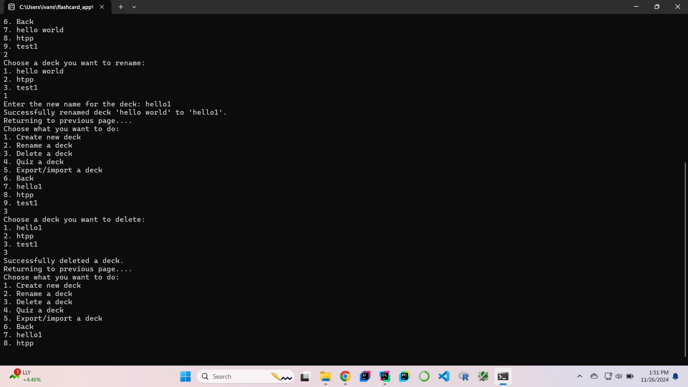

**Flashcard App**

**Project Overview**

The Flashcard App is a command-line application designed to help users 
memorize information easily through categorized flashcards. 
Users can create, read, update, and delete (CRUD) flashcards and folders, 
allowing for categorization and easy display of information. 
All flashcard data will be stored in JSON format, 
to ensure easy data management and compatibility 
with various data-handling tools and libraries.

**Project goal**

The primary objective of the Flashcard App is
to create an accessible and efficient tool 
for managing and reviewing knowledge. 
By combining CRUD operations with quiz mode and progress tracking capability, 
this app helps to enhance memory retention and 
make studying more effective and engaging.

**Dependencies**
1. C++20 compiler
2. nlohmann/json library: helps with reading, writing, and manipulation of JSON objects
3. tabulate library: helps with displaying visually appealing tables
4. nativefiledialog library: helps with cross-platform file dialog interface 

**Key Features**

1. Folder & card management (CRUD operations)
3. Quiz mode: linear/randomized
4. Interactive feedback: provides feedback for every action in the app
5. Export/import folders & flashcards via JSON files
6. Progress tracking:
   1. most mastered deck
   2. most reviewed deck
   2. how many times each deck has been reviewed
   2. a list of mastered decks
   3. the percentage of mastered deck
   4. how many successful vs failed answers for each card in each deck

**Input**
1. Users have options across pages and have to input the number (the option)

    
    

2. Deck and flashcard CRUD operations

    
    
    

3. Quiz answers

    

4. File path (using nativefiledialog)

    

**Result**
1. Deck and flashcard display

    
    

2. Quiz mode

    

3. Progress tracking

    

4. Export/import json file

    
    

**Discussion & Conclusion**

The Flashcard App is a good tool for organizing and retaining information. 
Its features, such as CRUD operations, quiz modes, and progress tracking, 
ensure a comprehensive and user-friendly experience. 
The use of JSON format for data storage enhances portability and 
data management flexibility.

